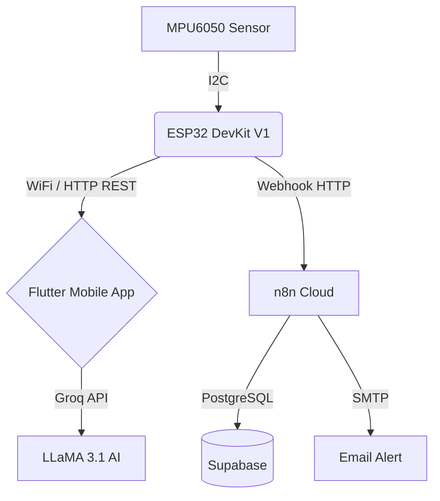

<div align="center">
  <h1>SpineGuard — Smart Spinal Posture Assistance System</h1>
  <p><em>Real-time intelligent postural assistance system based on ESP32, MPU6050 and Flutter.</em></p>
  
  
  
  
  
</div>

---

## About the Project

**SpineGuard** is a complete IoT and software solution designed to prevent back problems related to poor posture. By combining a wearable sensor (ESP32 + MPU6050) with a smart mobile application (Flutter), the system monitors spinal curvature in real time, alerts the user in case of prolonged poor posture, and offers personalized tracking with rehabilitation exercises and an interactive assistant.

**Authors:** Ayari Wiem & Sakroufi Aya — 1ING03

---

## Main Features

### Mobile Application (Flutter)
- **Real-Time Dashboard**: Visualization of the back angle via a dynamic postural ring and live statistics.
- **Chatbot (SpineBot)**: Smart assistant powered by the Groq API (LLaMA 3.1) to answer all your questions about back health.
- **Personalized Exercises**: 8 physiotherapy exercises with interactive animations and a timer.
- **History & Tracking**: Detailed charts (pitch/roll) to analyze posture evolution over time.
- **Accessibility**: Multi-language support (FR/AR/EN), light/dark themes, and voice feedback (TTS).

### Hardware (ESP32)
- **Advanced Filtering**: Complementary filter (α=0.1) ensuring stable measurements (~10ms).
- **Smart Alerts**: 4 status levels (GOOD, WARNING, BAD, CRITICAL) with RGB LED and non-blocking buzzer.
- **Connectivity & API**: Embedded REST HTTP server with full CORS support for communication with the application.

### Cloud & Automation
- **n8n.io**: Automation workflows for data processing and sending email alerts.
- **Supabase**: Robust PostgreSQL database storing posture history and alert logs.

---

## System Architecture



---

## Required Hardware

| Component | Connection / Pins |
| :--- | :--- |
| **ESP32 DevKit V1** | USB power |
| **MPU6050 Sensor** | `VCC`→3V3, `GND`→GND, `SDA`→GPIO21, `SCL`→GPIO22, `AD0`→GND |
| **RGB LED (Common Anode)**| `Anode`→3V3, `R`→GPIO12(220Ω), `G`→GPIO13(220Ω), `B`→GPIO14(220Ω) |
| **5V Active Buzzer** | `+`→GPIO25, `−`→GND |

---

## Installation Guide

### 1. ESP32 Firmware
1. Navigate to `arduino/SpineGuard_v4/`.
2. Duplicate `config.example.h` and rename it to `config.h`.
3. Configure your WiFi credentials:
   ```cpp
   #define WIFI_SSID      "Your_SSID"
   #define WIFI_PASSWORD  "Your_Password"
   ```
4. Install the required libraries in the Arduino IDE: **ArduinoJson**, **HTTPClient**.
5. Upload the code to the ESP32 and note the IP address displayed in the serial monitor (115200 baud).

### 2. Flutter Application
**Option A: Locally (Recommended)**
```bash
cd flutter_app
flutter pub get
flutter run
```
*Note: Go to the app's **Settings** to enter your ESP32's IP address.*

**Option B: Via FlutLab.io**
1. Create a blank project on FlutLab.
2. Import the contents of the `flutter_app` folder.
3. Run `flutter pub get` then start the build for your platform.

### 3. Cloud Backend (n8n & Supabase)
1. Create a database on Supabase using the provided SQL scripts.
2. Import the `n8n_spineguard_cloud.json` workflow located in the `n8n/` folder into your n8n instance.
3. Configure your credentials for Supabase and SMTP (Gmail).
4. Activate (Publish) the workflow.

---

## ESP32 Local API

The ESP32 exposes a RESTful API accessible on the local network:

| Method | Endpoint | Description |
| :--- | :--- | :--- |
| `GET` | `/api/status` | Returns the real-time postural state (JSON). |
| `POST`| `/api/calibrate` | Sets the current position as the reference (zero). |
| `GET` | `/api/history` | Retrieves the last 10 recorded measurements. |
| `GET` | `/api/recommendations` | Provides dynamic advice based on the current state. |
| `POST`| `/api/settings` | Changes the language or enables/disables silent mode. |

---

## Directory Structure

```text
SpineGuardRepo/
├── arduino/                 # C++ source code for the ESP32
├── flutter_app/             # Dart/Flutter source code for the mobile application
├── n8n/                     # JSON files for automation workflows
├── docs/                    # Documentation, diagrams and screenshots
└── README.md                # This file
```

---
<div align="center">
  <i>Developed with passion for improving postural health.</i>
</div>
