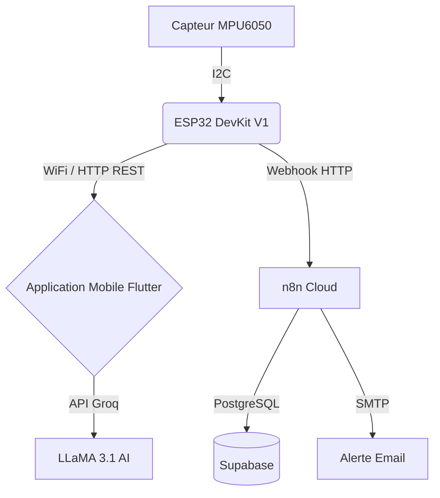

<div align="center">
  <h1>SpineGuard — Smart Spinal Posture Assistance System</h1>
  <p><em>Système intelligent d'assistance posturale en temps réel basé sur ESP32, MPU6050 et Flutter.</em></p>
  
  
  
  
  
</div>

---

## À propos du projet

**SpineGuard** est une solution complète IoT et logicielle conçue pour prévenir les problèmes de dos liés à une mauvaise posture. En combinant un capteur portable (ESP32 + MPU6050) et une application mobile intelligente (Flutter), le système surveille la courbure de la colonne vertébrale en temps réel, alerte l'utilisateur en cas de mauvaise posture prolongée, et propose un suivi personnalisé avec des exercices de rééducation et un assistant interactif.

**Auteurs :** Ayari Wiem & Sakroufi Aya — 1ING03

---

## Fonctionnalités Principales

### Application Mobile (Flutter)
- **Dashboard Temps Réel** : Visualisation de l'angle du dos via un anneau postural dynamique et des statistiques en direct.
- **Chatbot (SpineBot)** : Assistant intelligent propulsé par Groq API (LLaMA 3.1) pour répondre à toutes vos questions sur la santé du dos.
- **Exercices Personnalisés** : 8 exercices de kinésithérapie avec animations interactives et chronomètre.
- **Historique & Suivi** : Graphiques détaillés (pitch/roll) pour analyser l'évolution de la posture.
- **Accessibilité** : Support multi-langues (FR/AR/EN), thèmes clair/sombre, et retour vocal (TTS).

### Hardware (ESP32)
- **Filtrage Avancé** : Filtre complémentaire (α=0.1) assurant des mesures stables (~10ms).
- **Alertes Intelligentes** : 4 niveaux de statut (GOOD, WARNING, BAD, CRITICAL) avec LED RGB et buzzer non-bloquant.
- **Connectivité & API** : Serveur HTTP REST embarqué avec support CORS complet pour la communication avec l'application.

### Cloud & Automatisation
- **n8n.io** : Workflows d'automatisation pour le traitement des données et l'envoi d'alertes par email.
- **Supabase** : Base de données PostgreSQL robuste stockant l'historique des postures et les journaux d'alertes.

---

## Architecture du Système



---

## Matériel Requis

| Composant | Connexion / Pins |
| :--- | :--- |
| **ESP32 DevKit V1** | Alimentation USB |
| **Capteur MPU6050** | `VCC`→3V3, `GND`→GND, `SDA`→GPIO21, `SCL`→GPIO22, `AD0`→GND |
| **LED RGB (Anode Commune)**| `Anode`→3V3, `R`→GPIO12(220Ω), `G`→GPIO13(220Ω), `B`→GPIO14(220Ω) |
| **Buzzer Actif 5V** | `+`→GPIO25, `−`→GND |

---

## Guide d'Installation

### 1. Firmware ESP32
1. Naviguez dans `arduino/SpineGuard_v4/`.
2. Dupliquez `config.example.h` et renommez-le en `config.h`.
3. Configurez vos identifiants WiFi :
   ```cpp
   #define WIFI_SSID      "Votre_SSID"
   #define WIFI_PASSWORD  "Votre_MotDePasse"
   ```
4. Installez les bibliothèques requises dans l'Arduino IDE : **ArduinoJson**, **HTTPClient**.
5. Téléversez le code sur l'ESP32 et notez l'adresse IP affichée dans le moniteur série (115200 baud).

### 2. Application Flutter
**Option A : En local (Recommandé)**
```bash
cd flutter_app
flutter pub get
flutter run
```
*Note : Allez dans les **Paramètres** de l'application pour saisir l'adresse IP de votre ESP32.*

**Option B : Via FlutLab.io**
1. Créez un projet vierge sur FlutLab.
2. Importez le contenu du dossier `flutter_app`.
3. Exécutez `flutter pub get` puis lancez le build pour votre plateforme.

### 3. Backend Cloud (n8n & Supabase)
1. Créez une base de données sur Supabase en utilisant les scripts SQL fournis.
2. Importez le workflow `n8n_spineguard_cloud.json` situé dans le dossier `n8n/` vers votre instance n8n.
3. Configurez vos identifiants (Credentials) pour Supabase et SMTP (Gmail).
4. Activez (Publish) le workflow.

---

## API Locale de l'ESP32

L'ESP32 expose une API RESTful accessible sur le réseau local :

| Méthode | Endpoint | Description |
| :--- | :--- | :--- |
| `GET` | `/api/status` | Retourne l'état postural en temps réel (JSON). |
| `POST`| `/api/calibrate` | Définit la position actuelle comme référence (zéro). |
| `GET` | `/api/history` | Récupère les 10 dernières mesures enregistrées. |
| `GET` | `/api/recommendations` | Fournit des conseils dynamiques selon l'état actuel. |
| `POST`| `/api/settings` | Modifie la langue ou active/désactive le mode silencieux. |

---

## Structure du Répertoire

```text
SpineGuardRepo/
├── arduino/                 # Code source C++ pour l'ESP32
├── flutter_app/             # Code source Dart/Flutter de l'application mobile
├── n8n/                     # Fichiers JSON des workflows d'automatisation
├── docs/                    # Documentation, schémas et captures d'écran
└── README.md                # Ce fichier
```

---
<div align="center">
  <i>Développé avec passion pour l'amélioration de la santé posturale.</i>
</div>
